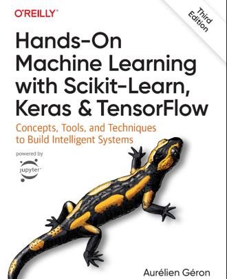

# Machine Learning
## Inleiding

**Academiejaar:** 2025–2026

**Lectoren:**
- Johan Decorte
- Koen Mertens

---

## Inhoud

- **Verplichte lectuur** (papier of e-book)
  
 
  
- **E-book** gratis beschikbaar via de bibliotheek (HOGENT-netwerk):
  - https://search.ebscohost.com/login.aspx?direct=true&db=nlebk&AN=3406174&site=ehost-live
- **Hoofdstukken**:
  - Part I
  - Hoofdstukken 1–9
  - Enkel de onderwerpen die behandeld worden in de github-repository (zie verder) zijn te kennen. 
- **Onderwerpen**
  - Klassieke machine-learningtechnieken
  - Supervised en unsupervised learning
  - Maten voor de nauwkeurigheid van een model
  - Uitrollen van een model in een productieomgeving

Kortom, we zien alle aspecten van de "klassieke" machine learning, maar gaan niet in op neurale netwerken. 

**Studiefiche:**
- https://bamaflexweb.hogent.be/BMFUIDetailxOLOD.aspx?a=193602&b=5&c=1

---

## Cursusmateriaal – Machine Learning

- GitHub repository:
  - https://github.com/HOGENT-ML/course
  - Inhoudstafel met hyperlinks: https://github.com/HOGENT-ML/course/blob/main/000-index.ipynb
- **In de loop van het semester zullen nog beperkte aanvullingen en aanpassingen gepubliceerd worden.**
- **Maak dus dat je altijd werkt met de meest recente versie van de github-repository.**

---

## Evaluatie

- 70%: individueel uit te voeren project
- 30%: meerkeuzevragen die peilen naar het inzicht in de concepten van de cursus via Ans

---

## Tools – Machine Learning

- **Visual Studio Code** met Python-extensie
- **Python versie**
  - ≥ 3.10 en ≤ 3.14
- **Python-libraries**
  - Kan je installeren in de loop van de lessen
  - Je kan ook gebruik maken van package manager uv (zie verder)
- **Alternatieven**
  - Google Colab (online)
  - Anaconda (Python, Jupyter Notebooks en data-libraries lokaal)

## Python package manager uv
- het gebruik van `uv` is vrijblijvend, maar biedt als voordeel dat je altijd de juiste modules en dependencies hebt.
- installeer eerst een recente versie van Python
- installatie: `pip install uv` of `python -m pip install uv`
- setup environment: 
  - open cmd-window in `course` directory
  - `uv init`
  - zet Python versie vast (bijv.): `uv python pin 3.14.2`
  - `uv sync`: dit zal alle modules opgelijst in `pyproject.toml` installeren
- docs: https://docs.astral.sh/uv/ 