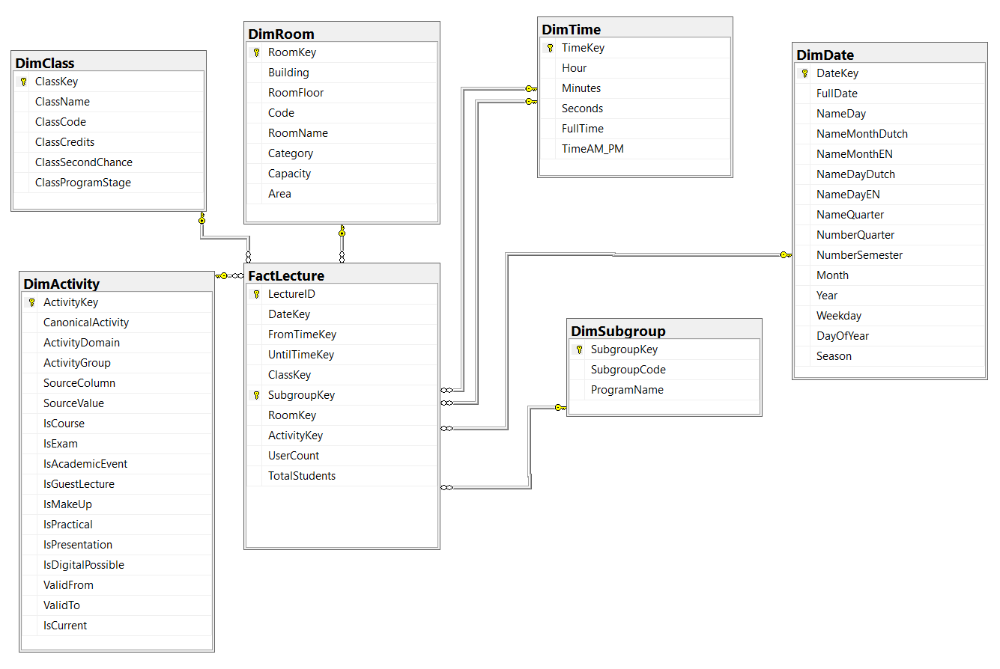
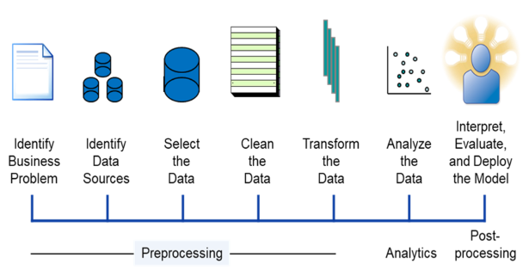

### Project: 

  **Aanwezigheden tijdens lessen**

---

### Situering van het project

- Gedurende het 1ste semester van het academiejaar hebben de derdejaarstudenten AI&Data Engineer een project gemaakt rond de aanwezigheden op tijdens de lessen in het B-gebouw. 
- De aanwezigheden in elke les werden ingeschat op basis van de wifi-connecties. 
- Gedurende dit project maak je een machine learning model om de aanwezigheden in een bepaalde les te voorspellen. 

---

### De data

- Je vertrekt van geaggregeerde data die aanwezig is in een datawarehouse (gestructureerd volgens het sterschema). 
- Je ontvangt de data als backup van een MS SQL Server database, die je hier kan downloaden: [data/wifi/WifiDWH.bak](data/wifi/WifiDWH.bak) 

---

Het sterschema ziet er als volgt uit:

---

### De feitentabel

Elke lijn in de feitentabel toont  
  
- het aantal aanwezige studenten (veld usercount = aantal unieke gebruikers van de WIFI)
- het aantal verwachte studenten (veld TotalStudents)  
 
in een bepaalde les voor een bepaalde subgroup. 

---

### Opdracht

- Verken de data zowel **visueel** als **cijfermatig**
- Reinig de data (data cleaning)
- Beslis welke data relevant is en welke niet
- Zoek eventueel bijkomende externe data die aanwezigheden kan beïnvloeden
- Construeer zelf nieuwe, voorspellende **features** (*feature engineering*)
- Bouw een **regressiemodel** om aanwezigheden te voorspellen voor een bepaalde les (olod), die plaatsvindt op een bepaalde datum/tijd, in een bepaald lokaal en voor een bepaalde klasgroep. 

---

### Opdracht (vervolg)
 
- Vergelijk verschillende regressiemodellen volgens de geziene best practices
- Evalueer modellen met meerdere maatstaven, waaronder: **MAPE** (Mean Absolute Percentage Error)
- Visualiseer en interpreteer de resultaten
- Maak een rangschikking van de belangrijkste factoren voor de aanwezigheid
- Bouw een Python-applicatie om het aantal aanwezigen in een bepaalde les te voorspellen. 

---

### Begeleiding

- Wekelijks vragenmoment tijdens het **vierde lesuur** (vanaf week 2)
- Extra info en tips via **Chamilo** 

---

  

### In te dienen
- Eén Python-notebook file (.ipynb) waarin je 
  - gestructureerd de data voorbereidt
  - machine learning modellen opstelt en evalueert
  - duidelijk aantoont wat de prestatie is van je beste model. 
- Eén Python-applicatie (.py) die op basis van een csv-file met eeen aantal lijnen (telkens tijdstip, olod, subgroep en lokaal) het aantal aanwezigen kan voorspellen
- Reflectietekst over het nut en de valkuilen van het gebruik van AI-tools bij het uitvoeren van de opdracht. 

---

### Examen

- Mondelinge verdediging van het project
- Individuele presentatie aan de lector
- Tijdens het examen ontvang je:
  - een csv file met een 10-tal lijnen zoals hierboven beschreven
- Met je eigen Python-applicatie:
  - maak je voorspellingen voor het aantal aanwezigen per les
  - bereken je onmiddellijk een inschatting van de de nauwkeurigheid
- Een voorbeeldbestand wordt vooraf ter beschikking gesteld

---

### Belang van preprocessing
 

+/- **80–90%** van de totale projecttijd gaat naar preprocessing:
- foutieve en ontbrekende waarden
- complexiteit van het businessprobleem
- algoritmes zijn meestal off-the-shelf beschikbaar

---

### Evaluatie

- Studiefiche:
  - https://bamaflexweb.hogent.be/BMFUIDetailxOLOD.aspx?a=181008&b=5&c=1
- Je werkt **alleen**
- Punten op het project tellen voor 70% van het totaal 
- Tweede examenkans:
  - verderwerken aan hetzelfde project

---

### Full AI-use with human oversight

- Gebruik AI als assistent, niet als vervanging
- Evalueer AI-output kritisch
- Wat in de cursus staat heeft voorrang op wat AI "aanprijst"
- Werk met AI als **co‑pilot**
- Documenteer:
  - waarvoor AI werd gebruikt
  - alle prompts en chatlogs
- Gegenereerde code hoeft niet volledig opgelijst te worden, maar: je moet ze **zelf begrijpen**
- Dien een reflectie over het nut en de valkuilen van AI (15% van de projectscore)
